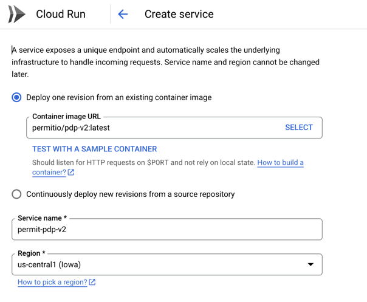
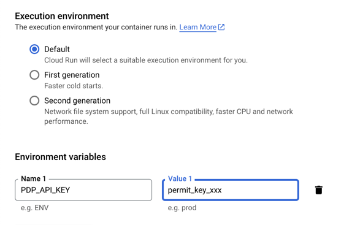

# Deploying PDP on GCP Cloud Run
Our PDP image runs on GCP Cloud Run without any modification. You can deploy it by using our public image on [Docker Hub](https://hub.docker.com/r/oryd/pdp).

## Step by step guide
In the following step, we will show you how to deploy our PDP image on GCP Cloud Run,
And in the end we'll share the final YAML file that you can use to deploy the PDP on GCP Cloud Run.

### 1. Create a new Cloud Run service
Create a new Cloud Run service by clicking on the `Create Service` button in the Cloud Run dashboard.

### 2. Configure the service
Now, we'll set the name, image and some other configurations for the service.
First, in the "Container Image URL" field, enter the following image `permitio/pdp-v2:latest`.
Then, set the name of the service to the name that fits you.

Obviously, you can change the region and other configurations as you wish.

### 3. Adjust the Auto Scaling configuration (Recommended)
In the "Auto Scaling" section, set the "Minimum number of instances" to 1.
This will make sure that there is always at least one instance of the PDP running - to avoid cold starts.
We don't want that authorization queries and requests to the PDP will fail or take a long time because of cold starts.

### 4. Set the container port
Our PDP image runs on port `7000`, so we need to set the container port to `7000`.

### 5. Set the environment variables
Now, we need to set the environment variables for the PDP.
The only required environment variable is `PDP_API_KEY`, which is the API key that you got from Permit.io.
See [Get your API Key](/api/api-with-cli) for more information.
Note that you can and should set the environment variables from a secret, using your selected secret store provider.

### 6. Ready to deploy !
Now, we are ready to deploy the PDP.
Click on the "Create" button to deploy the PDP.
You can see the logs of the deployment in the "Logs" tab, and if the deployment succeeded, you will see the URL of the PDP in the top section of the Cloud Run service.

## YAML file
We shared the YAML file that we used to deploy the PDP on GCP Cloud Run.
Take a look at the file `cloud-run.yaml`.
